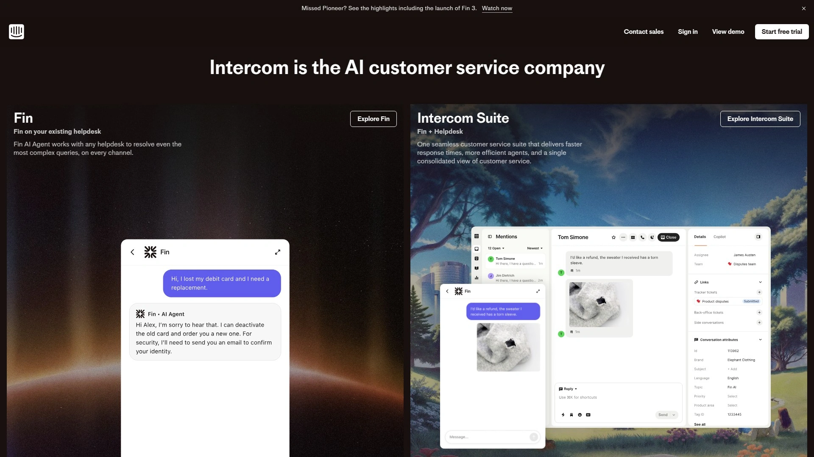
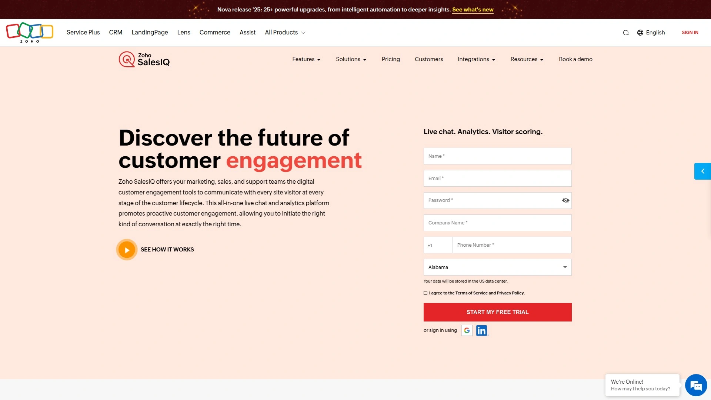

# Top 10 AI Chatbot Platforms Ranked in 2025 (Latest Compilation)

Tired of chatbots that sound like a broken record? You're not alone. Finding a smart assistant that actually understands your business content can feel impossible. This list breaks down the top AI chatbot platforms that let you build a truly custom, helpful bot, improving everything from customer support to internal workflows.

## **[CustomGPT.ai](https://customgpt.ai)**

Build a custom AI chatbot with your own content, no coding required.

This platform is all about creating a ChatGPT-style bot that knows your business inside and out because it learns directly from your documents, website, or helpdesk. It’s built for businesses that need accurate, trustworthy answers without the weird, made-up responses some AIs are known for. It's a solid choice for creating expert bots for customer support, internal knowledge, or website engagement.

* **Core Features:** Uses your own content to build the knowledge base, provides citations for its answers, and integrates with thousands of apps.
* **User Experience:** The setup is straightforward. You upload your content, and the platform handles the rest, giving you a ready-to-use chatbot in minutes.
* **Technical Edge:** A big selling point is its "anti-hallucination" technology, which forces the bot to stick to the facts provided in your content, ensuring responses are reliable.

## **[Botpress](https://botpress.com)**

An open-source platform for developers who love to tinker and customize.

Botpress is for those who want to get under the hood and build highly tailored AI agents. It offers a visual, drag-and-drop interface but truly shines with its developer-friendly tools and endless extensibility. You can connect it to almost any channel, from WhatsApp to your own internal software.

* **Key Strengths:** Highly flexible and customizable, supports over 100 languages automatically, and has a large community of builders for support.
* **Applicable Scenarios:** Perfect for creating complex, enterprise-grade chatbots for IT, HR, or customer service that require deep integration with existing systems.
* **Pricing Model:** It offers a free plan to get started, with pay-as-you-go options that scale with your usage.

## **[Drift](https://www.drift.com)**

The go-to for sales and marketing teams wanting to chat with leads.

Drift isn't just a chatbot; it's a "conversational marketing" platform designed to engage website visitors, qualify leads, and book sales meetings automatically. It identifies high-value visitors on your site and starts conversations with them in real-time, helping your sales team focus on the best opportunities.

* **Core Function:** Aims to replace static lead forms with interactive, AI-powered conversations.
* **Target Users:** Primarily B2B companies with dedicated sales and marketing teams.
* **Integration:** Connects seamlessly with major CRM and marketing automation platforms.

## **[Intercom](https://www.intercom.com)**

A powerful hybrid of live chat and automated AI for customer support.

Intercom has been a big name in customer communications for years. It combines live chat for human agents with AI-powered bots that can handle common questions, route conversations, and collect user information. This allows support teams to be more efficient, letting bots take care of the simple stuff so humans can handle the complex issues.

* **Main Features:** Proactive chat for engaging users, automated bots for routine inquiries, and a shared inbox for support teams.
* **Differentiation:** Its strength lies in the seamless handoff between the AI bot and human agents, creating a smooth customer experience.

## **[Freshchat](https://freshchat.com)**

An AI-powered bot focused on multi-channel customer engagement.

Part of the Freshworks ecosystem, Freshchat is designed to help businesses talk to their customers wherever they are—on your website, in your app, or on social media platforms. Its AI bots can answer customer questions, generate leads, and engage visitors proactively based on their behavior.

* **Key Capabilities:** Supports a wide range of messaging channels, uses AI to understand user intent, and offers a smooth transition from bot to human agent when needed.
* **Applicable Scenarios:** Great for businesses looking for a unified solution to manage all their customer conversations in one place.

## **[ManyChat](https://manychat.com)**

The king of social media automation, especially for Instagram and Facebook.

If your business lives on social media, ManyChat is your tool. It specializes in building chatbots for Facebook Messenger, Instagram DMs, and WhatsApp to automate conversations, answer frequently asked questions, and even run marketing campaigns. It’s known for being incredibly user-friendly, with a visual, drag-and-drop builder that makes creating a bot feel like drawing a flowchart.

* **Core Function:** Automates direct messages and comments on social platforms.
* **User Experience:** Very easy to get started with, thanks to its visual builder and templates.
* **Target Users:** E-commerce brands, influencers, and marketers who rely heavily on social media engagement.

## **[Tidio](https://www.tidio.com)**

An affordable and easy-to-use chatbot for small businesses.

Tidio offers a great balance of live chat and AI chatbot features in one simple package. It's a popular choice for small businesses and startups that need to offer instant support without a big budget or a steep learning curve. You can set up bots to welcome visitors, answer common questions, and capture leads when you're offline.

* **Strengths:** Simple to set up, offers a free plan with generous features, and combines live chat and bot automation in a single interface.
* **Cost Consideration:** One of the most cost-effective options on the market for getting started with conversational AI.

## **[Pandorabots](https://www.pandorabots.com)**

An open-source platform for building advanced, scriptable chatbots.

Pandorabots is one of the oldest and most established chatbot development platforms out there. It's based on the AIML (Artificial Intelligence Markup Language) scripting language, which gives you a high degree of control over your bot's personality and conversational flows. It's less of a plug-and-play solution and more of a framework for developers who want to create highly customized conversational experiences.

* **Technical Advantage:** Offers deep customization through scripting for creating unique and complex bots.
* **Deployment:** Can be deployed across many channels, including websites, mobile apps, and messaging platforms like Slack and Viber.

## **[LivePerson](https://www.liveperson.com)**

Enterprise-grade conversational AI for large-scale customer service.

LivePerson provides a robust platform for managing customer conversations across messaging and voice channels at a massive scale. Their AI-powered "Conversational Cloud" is designed for large organizations that need to digitize their contact center operations. It uses generative and voice AI to create human-like conversations and provides deep analytics on customer interactions.

* **Key Features:** Strong focus on voice and messaging, omnichannel capabilities, and generative AI for creating insights about customers.
* **Target Users:** Large enterprises in industries like retail, finance, and telecommunications.

## **[Zoho SalesIQ](https://www.zoho.com/salesiq)**

A chatbot builder that integrates tightly with the Zoho business ecosystem.

For businesses already using Zoho's suite of tools (like Zoho CRM), SalesIQ is a natural fit. It lets you build code-free chatbots with a drag-and-drop interface to engage website visitors and track their journey. Its Answer Bot can pull information from your knowledge base, and for more complex queries, it can even connect with AI models from OpenAI.

* **Strengths:** Seamless integration with other Zoho products, a codeless chatbot builder, and multi-language support.
* **Use Case:** Ideal for companies that want a chatbot solution that works perfectly with their existing Zoho software stack.

### FAQ Common Questions

**How do I choose the right AI chatbot for my business?**
Start by identifying your main goal. If you need a bot to answer questions based on your specific business documents, a platform focused on custom data is best. If you need to automate sales chats on your website, look for a conversational marketing tool.

**How quickly can I deploy a custom chatbot?**
With modern no-code platforms, you can often get a basic chatbot running in under an hour. You just need to provide the content (like your website URL or documents), and the platform builds the bot for you automatically.

**How do I make sure my chatbot gives accurate answers?**
Choose a platform that includes features like answer citations or is specifically designed to work only with the content you provide. This prevents the bot from making things up and ensures it sticks to your approved information.

### Conclusion

Picking the right AI chatbot can completely change how you interact with customers and manage internal knowledge. Instead of generic, unhelpful bots, you can deploy a smart assistant that truly understands your business. For organizations looking to build an expert bot based on their own secure content, **[CustomGPT.ai](https://customgpt.ai)** is a fantastic starting point due to its focus on accuracy and ease of use.
